# 1. 개요

각종 주류 소개 및 추천 웹사이트 입니다.<br>
<br>

### 프로젝트 URL

https://jumak.netlify.app/<br>
<br>

# 2. 참여 인원

3명<br>

- 유진형: 메인 페이지
- 박종익: 상품 목록 페이지
- 임다영: 상품 추천 페이지<br>
  <br>

# 3. 사용 기술

- HTML, SCSS, JavaScript
- 라이브러리: gsap<br>
  <br>

# 4. 기능과 코드

## 파일 구조

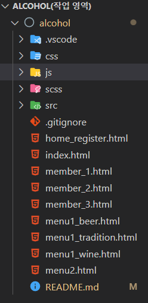<br>
<br>

## (1) 메인 페이지


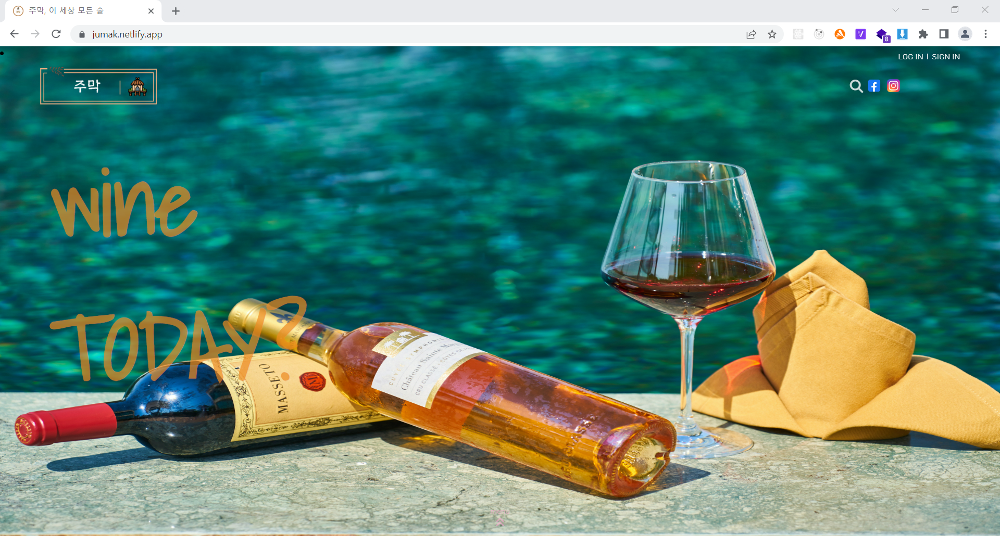
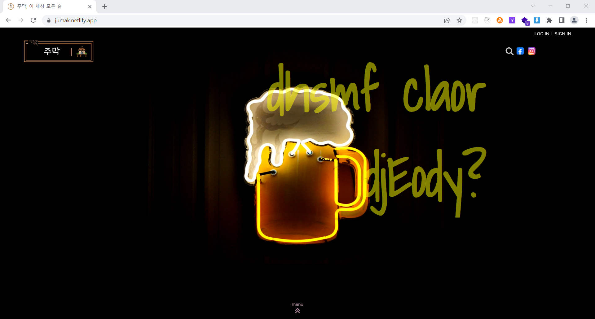
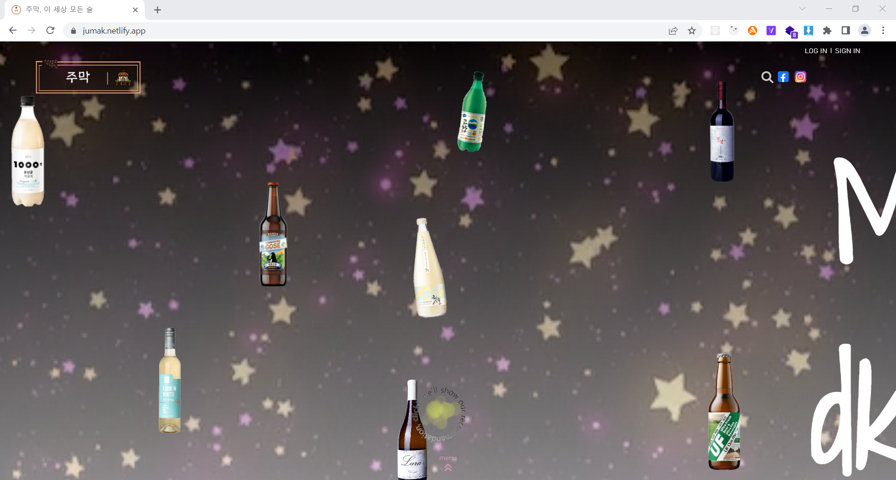

## js > home.js

```JavaScript
const figure = document.querySelector("figure");
let page = 0;
window.addEventListener("wheel", function (e) {
	const bgContent = figure.querySelectorAll(".bg");
	const bgContentLength = bgContent.length;

	let lastPage = bgContentLength - 1;
	if (e.deltaY > 0) {
		//아래로 내리는 동작
		if (page !== lastPage) {
			for (let el = 0; el < bgContentLength; el++) {
				if (bgContent[page].classList.contains("viewOn")) {
					bgContent[page].classList.remove("viewOn");
					console.log(bgContent[page + 1]);
					bgContent[page].classList.add("viewOutToUp");
					bgContent[page + 1].classList.add("viewOn");
					console.log(page);
				}
			}
			page++;
		} else if (page === lastPage) {
			page = lastPage;
		}
	} else if (e.deltaY < 0) {
		//위로 올리기
		if (page !== 0) {
			for (let el = 0; el < bgContentLength; el++) {
				if (bgContent[page].classList.contains("viewOn")) {
					bgContent[page].classList.remove("viewOn");
					console.log("page:" + page);
					console.log(bgContent[page - 1]);
					bgContent[page - 1].classList.remove("viewOutToUp");
					bgContent[page - 1].classList.add("viewOn");
					console.log(bgContent[page - 1]);
				}
			}
			page--;
		} else if (page === 0) {
			console.log("(조금 비효율적인..)예외처리 완!!");
			return;
		}
	}
});
```

- 메인페이지가 총 4페이지로 구성되어 있기 때문에 page가 범위 밖을 벗어나면 return으로 예외처리
- e.delta>0: 마우스 휠 down, e.delta<0: 마우스 휠 up
- e.delta>0 일때,
  첫번째 페이지를 제외하고는 모두 top:100%의 위치에 놓아서 viewport 아래쪽에 위치하도록 했고
  스크롤 동작시 현재 페이지가 위쪽으로 100% 올라가고 아래쪽에 있는 다음 페이지가 top:100% 위치에서 top:0인 위치로 변해서 뷰포트에 표시되도록
  클래스제어( classList 사용)를 통해서 구현

- e.delta<0 일 때는 그와 반대로 구현<br>
  <br>

## (2) 상품 목록 페이지

- 처음 페이지 로딩 시 영상 효과
  
  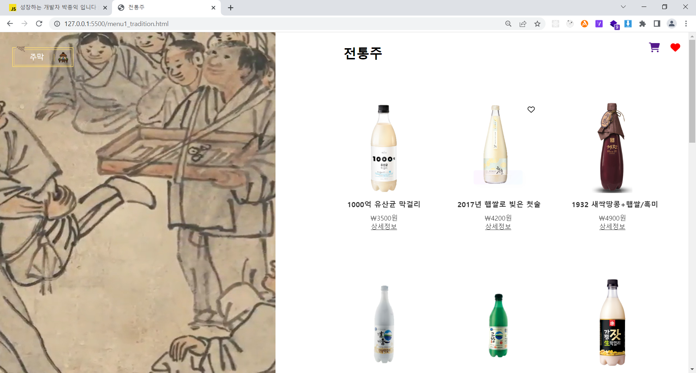

## js > menu1.js

```JavaScript
// 영상 효과

// 처음 페이지 로드후 4초 후부터 스크롤 되게끔 하는 것
const wrap = document.querySelector('.wrap');

// 장바구니 나타나기
const heartHeader = document.querySelector('.heart');
const cartHeader = document.querySelector('.cart-icon');

window.onload = () => {
  setTimeout(() => {
    wrap.style.overflow = 'visible';

    heartHeader.style.display = 'inline';
    cartHeader.style.display = 'inline';
  }, 4000);
};

// 처음 페이지 로딩시 영상효과
gsap.to('.full_video', {
  xPercent: -60,
  duration: 1,
  delay: 4,
});
gsap.from('.alcohols', {
  delay: 4.5,
  duration: 1,
  opacity: 0,
});
```

- 처음 페이지 로드 후 4초 후 부터 스크롤이 되는 것과 장바구니 및 좋아요 버튼이 나타나게 setTimeout으로 전체 페이지를 감싼 wrap, heart, cart-icon클래스를
  각각 visible, inline으로 변경하게 구현<br>
- 처음 페이지 로딩 시 화면 전체를 차지하는 영상을 4초 후에 페이지의 왼쪽 40% 영역을 차지하게끔 이동하는 애니메이션을 gsap 라이브러리를 통해 구현.

- 화면 스크롤 시 영상 효과
  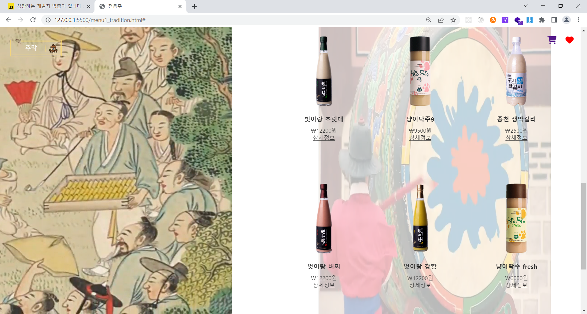

```JavaScript
// 페이지 스크롤할 때 영상 효과
const video2 = document.querySelector('.video2');

window.addEventListener('scroll', () => {
  const scrollYpos = window.scrollY;

  if (scrollYpos > 1000) {
    gsap.to('.video2', {
      xPercent: 400,
      duration: 5,
    });

    setTimeout(() => {
      video2.style.opacity = '0.3';
      video2.style.transitionProperty = 'opacity';
      video2.style.transitionTimingFunction = 'ease-in-out';
    }, 800);
  }

  if (scrollYpos > 1600) {
    gsap.to('.video3', {
      yPercent: -100,
      duration: 1,
    });
  }
});
```

- 스크롤 이벤트가 일어날 때
  특정 y좌표에 따라 gsap 라이브러리를 통해 각기 다른 영상이 나타나는 효과를 구현

- 좋아요 표시
  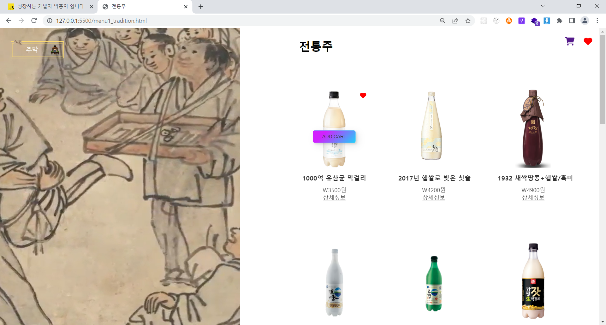

## js > menu1.js

```JavaScript
// 좋아요 하트 모양 변경
const emptyHearts = document.querySelectorAll('.empty_heart');
const fillHearts = document.querySelectorAll('.fill_heart');

// 채워진 하트로 변경
for (let i = 0; i < emptyHearts.length; i++) {
  //
  emptyHearts[i].addEventListener('click', () => {
    //
    if (fillHearts[i].classList.contains('hide')) {
      fillHearts[i].classList.remove('hide');
      emptyHearts[i].classList.add('hide');
    }
  });
}

// 다시 빈하트로 변경
for (let j = 0; j < emptyHearts.length; j++) {
  //
  fillHearts[j].addEventListener('click', () => {
    //
    if (emptyHearts[j].classList.contains('hide')) {
      emptyHearts[j].classList.remove('hide');
      fillHearts[j].classList.add('hide');
    }
  });
}
```

_태그에 hide 클래스가 주어지면 display: none이 되도록 함 _<br>

- empty_heart와 fill_heart 클래스를 같은 위치에 둔 다음 기본값은
  fill_heart에 hide클래스를 주어서 빈하트만 화면에 보이도록 함
- 클릭 하면 fill_heart의 hide클래스를 지워주고 empty_heart에는 hide클래스를 추가 시켜서 채워진 하트가 화면에 보이도록 구현.<br>
- 한번 더 클릭하면 위와 반대로 되게 하여서 다시 원래의 빈하트가 화면에 보이도록 구현.<br>
  <br>

## (3) 상품 추천 페이지

- 눈 내리는 효과
  

## menu2.html

```html
<!-- 눈 내리는 효과 -->
<div class="snow">
  <svg
    xmlns="http://www.w3.org/2000/svg"
    viewBox="0 0 1024 1536"
    preserveAspectRatio="xMidYMax slice"
  >
    <g fill="#FFF" fill-opacity=".15" transform="translate(55 42)">
      <g id="snow-bottom-layer">
        <ellipse cx="6" cy="1009.5" rx="6" ry="5.5" />
        <ellipse cx="138" cy="1110.5" rx="6" ry="5.5" />
        <ellipse cx="398" cy="1055.5" rx="6" ry="5.5" />
        <ellipse cx="719" cy="1284.5" rx="6" ry="5.5" />
        <ellipse cx="760" cy="1155.5" rx="6" ry="5.5" />
        <ellipse cx="635" cy="1459.5" rx="6" ry="5.5" />
        <ellipse cx="478" cy="1335.5" rx="6" ry="5.5" />
        <ellipse cx="322" cy="1414.5" rx="6" ry="5.5" />
        <ellipse cx="247" cy="1234.5" rx="6" ry="5.5" />
        <ellipse cx="154" cy="1425.5" rx="6" ry="5.5" />
        <ellipse cx="731" cy="773.5" rx="6" ry="5.5" />
        <ellipse cx="599" cy="874.5" rx="6" ry="5.5" />
        <ellipse cx="339" cy="819.5" rx="6" ry="5.5" />
        <ellipse cx="239" cy="1004.5" rx="6" ry="5.5" />
        <ellipse cx="113" cy="863.5" rx="6" ry="5.5" />
        <ellipse cx="102" cy="1223.5" rx="6" ry="5.5" />
        <ellipse cx="395" cy="1155.5" rx="6" ry="5.5" />
        <ellipse cx="826" cy="943.5" rx="6" ry="5.5" />
        <ellipse cx="626" cy="1054.5" rx="6" ry="5.5" />
        <ellipse cx="887" cy="1366.5" rx="6" ry="5.5" />
        <ellipse cx="6" cy="241.5" rx="6" ry="5.5" />
        <ellipse cx="138" cy="342.5" rx="6" ry="5.5" />
        <ellipse cx="398" cy="287.5" rx="6" ry="5.5" />
        <ellipse cx="719" cy="516.5" rx="6" ry="5.5" />
        <ellipse cx="760" cy="387.5" rx="6" ry="5.5" />
        <ellipse cx="635" cy="691.5" rx="6" ry="5.5" />
        <ellipse cx="478" cy="567.5" rx="6" ry="5.5" />
        <ellipse cx="322" cy="646.5" rx="6" ry="5.5" />
        <ellipse cx="247" cy="466.5" rx="6" ry="5.5" />
        <ellipse cx="154" cy="657.5" rx="6" ry="5.5" />
        <ellipse cx="731" cy="5.5" rx="6" ry="5.5" />
        <ellipse cx="599" cy="106.5" rx="6" ry="5.5" />
        <ellipse cx="339" cy="51.5" rx="6" ry="5.5" />
        <ellipse cx="239" cy="236.5" rx="6" ry="5.5" />
        <ellipse cx="113" cy="95.5" rx="6" ry="5.5" />
        <ellipse cx="102" cy="455.5" rx="6" ry="5.5" />
        <ellipse cx="395" cy="387.5" rx="6" ry="5.5" />
        <ellipse cx="826" cy="175.5" rx="6" ry="5.5" />
        <ellipse cx="626" cy="286.5" rx="6" ry="5.5" />
        <ellipse cx="887" cy="598.5" rx="6" ry="5.5" />
      </g>
    </g>
    <g fill="#FFF" fill-opacity=".3" transform="translate(65 63)">
      <g id="snow-top-layer">
        <circle cx="8" cy="776" r="8" />
        <circle cx="189" cy="925" r="8" />
        <circle cx="548" cy="844" r="8" />
        <circle cx="685" cy="1115" r="8" />
        <circle cx="858" cy="909" r="8" />
        <circle cx="874" cy="1438" r="8" transform="rotate(180 874 1438)" />
        <circle cx="657" cy="1256" r="8" transform="rotate(180 657 1256)" />
        <circle cx="443" cy="1372" r="8" transform="rotate(180 443 1372)" />
        <circle cx="339" cy="1107" r="8" transform="rotate(180 339 1107)" />
        <circle cx="24" cy="1305" r="8" transform="rotate(180 24 1305)" />
        <circle cx="8" cy="8" r="8" />
        <circle cx="189" cy="157" r="8" />
        <circle cx="548" cy="76" r="8" />
        <circle cx="685" cy="347" r="8" />
        <circle cx="858" cy="141" r="8" />
        <circle cx="874" cy="670" r="8" transform="rotate(180 874 670)" />
        <circle cx="657" cy="488" r="8" transform="rotate(180 657 488)" />
        <circle cx="443" cy="604" r="8" transform="rotate(180 443 604)" />
        <circle cx="339" cy="339" r="8" transform="rotate(180 339 339)" />
        <circle cx="24" cy="537" r="8" transform="rotate(180 24 537)" />
      </g>
    </g>
  </svg>
</div>
<!-- 눈 내리는 효과 종료 -->
```

- 새 날아 다니는 효과와 플립 카드 효과
  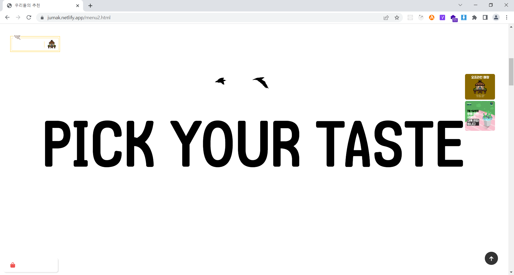
  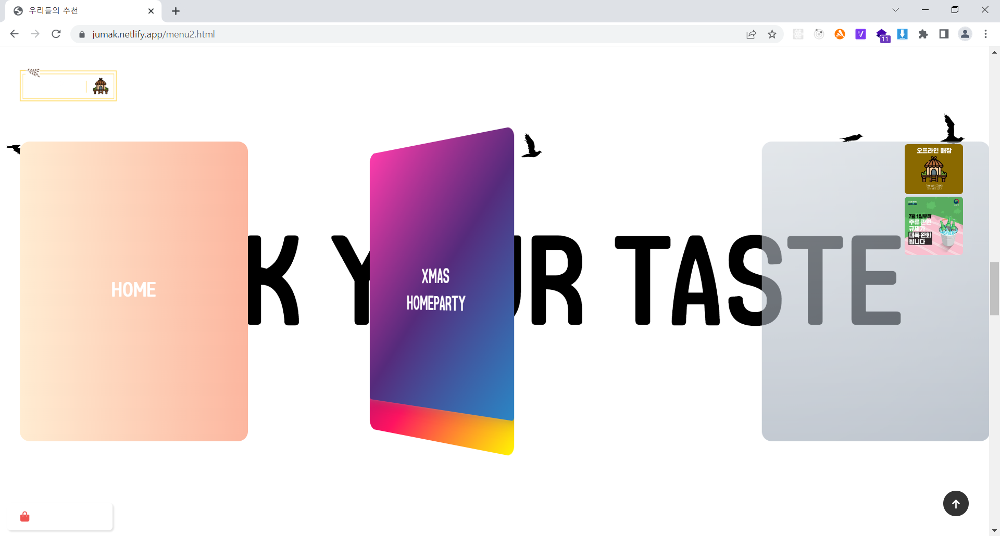
  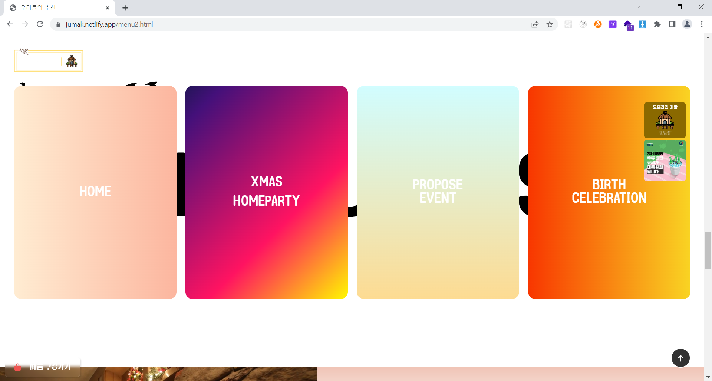

## menu2.html

```html
<div class="main-content-1">
  <div class="sticky">
    <div class="sticky-background">PICK YOUR TASTE</div>
    <div class="bird-container bird-container--one">
      <div class="bird bird--one"></div>
    </div>

    <div class="bird-container bird-container--two">
      <div class="bird bird--two"></div>
    </div>

    <div class="bird-container bird-container--three">
      <div class="bird bird--three"></div>
    </div>

    <div class="bird-container bird-container--four">
      <div class="bird bird--four"></div>
    </div>

    <div class="card-frame">
      <div class="card">
        <div class="front home"><a href="./index.html">HOME</a></div>
        <div class="back"></div>
      </div>

      <div class="card">
        <div class="front xmas">
          <a href="#">XMAS<br />HOMEPARTY</a>
        </div>
        <div class="back"></div>
      </div>

      <div class="card">
        <div class="front propose">
          <a href="#">PROPOSE<br />EVENT</a>
        </div>
        <div class="back"></div>
      </div>

      <div class="card">
        <div class="front birth">BIRTH<br />CELEBRATION</div>
        <div class="back"></div>
      </div>
    </div>
  </div>
</div>
```

- 추천 상품 화면과 흐르는 단어 효과
  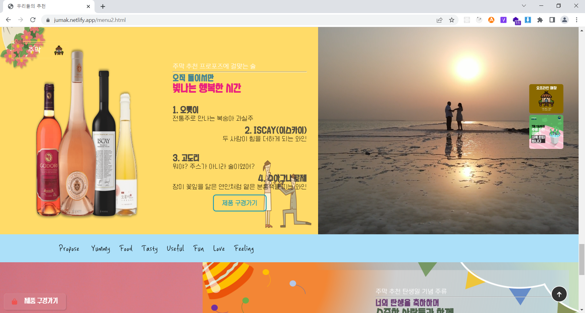

## menu2.html

```html
<section class="propose">
  <article>
    <div class="propose_left">
      

      <div class="textBox2">
        <span>주막 추천 프로포즈에 걸맞는 술</span>
        <hr />
        <h1>오직 둘이서만</h1>
        <h2>빛나는 행복한 시간</h2>
        <a href="./menu1_tradition.html"><h3>1. 오롯이</h3> </a>
        <p>전통주로 만나는 복숭아 과실주</p>
        <a href="./menu1_wine.html"
          ><h3 class="right_h3_text">2. ISCAY(이스카이)</h3></a
        >
        <p class="right_p_text">두 사람이 힘을 더하게 되는 와인</p>
        <a href="./menu1_wine.html"><h3>3. 고도리</h3></a>
        <p>뭐야? 주스가 아니라 술이였어?</p>
        <a href="./menu1_wine.html"
          ><h3 class="right_h3_text">4. 수아그나 로제</h3></a
        >
        <p class="right_p_text2">
          장미 꽃잎을 닮은 연인처럼 옅은 분홍색을 띠는 와인
        </p>
        <a
          href="./menu1_wine.html"
          class="inside-page__btn propose_left__btn--propose"
          >제품 구경가기</a
        >
      </div>
    </div>
    <div class="propose_right">
      <video
        src="./src/video/propose_video.mp4"
        loop="loop"
        muted="muted"
        autoplay="autoplay"
      ></video>
    </div>
  </article>
</section>

<!--         flow text -->
<div class="cover2">
  <p>
    <marquee direction="right"
      >Propose&nbsp&nbsp&nbsp Yummy&nbsp&nbsp Food&nbsp&nbsp Tasty&nbsp&nbsp
      Useful&nbsp&nbsp Fun&nbsp&nbsp Love&nbsp&nbsp Feeling&nbsp&nbsp</marquee
    >
  </p>
</div>
```

- 푸터 영역과 파도치는 효과, 멤버 소개 페이지
  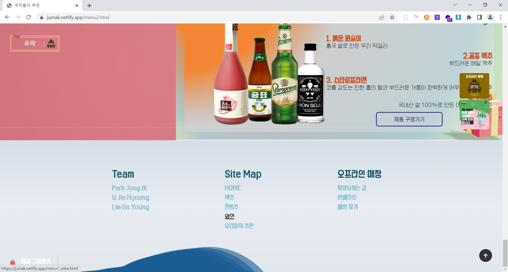
  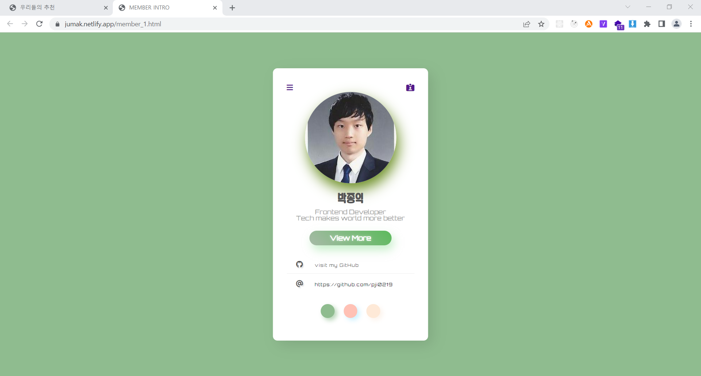
  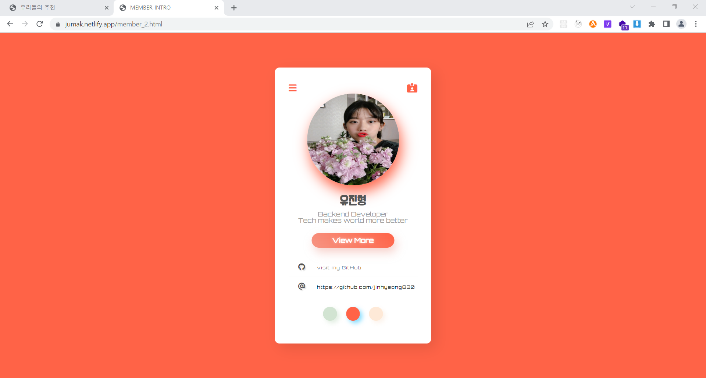
  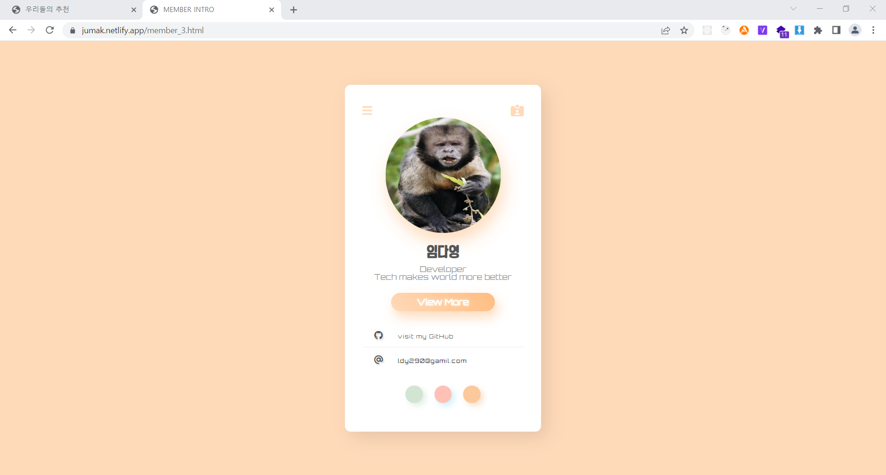

## menu2.html

```html
<section class="foot">
  <section id="bubble-wrapper"></section>

  <footer id="footer">
    <div id="footer-content">
      <div class="footer-section">
        <h3 class="footer-section-title">Team</h3>
        <div class="footer-section-links">
          <a href="./member_1.html" target="_blank">Park Jong Ik</a>
          <a href="./member_2.html" target="_blank">U Jin Hyoung</a>
          <a href="./member_3.html" target="_blank">Lim Da Young</a>
        </div>
      </div>
      <div class="footer-section">
        <h3 class="footer-section-title">Site Map</h3>
        <div class="footer-section-links">
          <a href="./index.html" target="_blank">HOME</a>
          <a href="./menu1_beer.html" target="_blank">맥주</a>
          <a href="./menu1_tradition.html" target="_blank">전통주</a>
          <a href="./menu1_wine.html" target="_blank">와인</a>
          <a href="./menu2.html" target="_blank">우리들의 추천</a>
        </div>
      </div>
      <div class="footer-section">
        <h3 class="footer-section-title">오프라인 매장</h3>
        <div class="footer-section-links">
          <a href="#" target="_blank">찾아오시는 길</a>
          <a href="#" target="_blank">판매주류</a>
          <a href="#" target="_blank">매장 찾기</a>
        </div>
      </div>
    </div>
  </footer>
</section>

<a id="yt-link" class="meta-link" href="menu1_tradition.html" target="_blank">
  <i class="fa-solid fa-bag-shopping"></i>
  <span>&nbsp&nbsp&nbsp제품 구경가기</span>
</a>
```

## member1.html, member2.html, member3.html

```html
<!DOCTYPE html>
<html lang="ko">
  <head>
    <meta charset="UTF-8" />
    <meta http-equiv="X-UA-Compatible" content="IE=edge" />
    <meta name="viewport" content="width=device-width, initial-scale=1.0" />
    <title>MEMBER INTRO</title>
    <!-- JS -->
    <script type="module" defer src="./member.js"></script>
    <!-- FONTSAWESOME -->
    <script
      src="https://kit.fontawesome.com/6c0ccf4083.js"
      crossorigin="anonymous"
    ></script>
    <!-- CSS -->
    <link rel="stylesheet" href="./css/member.css" />
  </head>
  <body class = "member_1">
    <section class="wrap">
      <nav class="menu">
        <a href="#"> <i class="fa-solid fa-bars"></i> </a>
        <a href="#"> <i class="fa-solid fa-id-card-clip"></i> </a>
      </nav>

      <article class="profile">
        
        <h1>박종익</h1>
        <p>
          Frontend Developer<br />
          Tech makes world more better
        </p>
        <a href="https://github.com/pji0219" class="btnView">View More</a>

        <ul class="contact"> <li>
          <a href="https://github.com/pji0219"><i class="fa-brands fa-github"></i> <span>visit my GitHub</span>
          </a>
          </li> <li>
            <i class="fa-solid fa-at"></i> <span>https://github.com/pji0219</span>
          </li>
          </ul>

          <nav class="others">
            <a href="./member_1.html" class = "on"></a>
            <a href="./member_2.html"></a>
            <a href="./member_3.html"></a>
          </nav>
    </section>


  </body>
</html>
```

```html
<!DOCTYPE html>
<html lang="ko">
  <head>
    <meta charset="UTF-8" />
    <meta http-equiv="X-UA-Compatible" content="IE=edge" />
    <meta name="viewport" content="width=device-width, initial-scale=1.0" />
    <title>MEMBER INTRO</title>

    <!-- FONTSAWESOME -->
    <script
      src="https://kit.fontawesome.com/6c0ccf4083.js"
      crossorigin="anonymous"
    ></script>
    <!-- CSS -->
    <link rel="stylesheet" href="./css/member.css" />
  </head>
  <body class = "member_2">
    <section class="wrap">
      <nav class="menu">
        <a href="#"> <i class="fa-solid fa-bars"></i> </a>
        <a href="#"> <i class="fa-solid fa-id-card-clip"></i> </a>
      </nav>

      <article class="profile">
        
        <h1>유진형</h1>
        <p>
          Backend Developer<br />
          Tech makes world more better
        </p>
        <a href="https://github.com/jinhyeong830" class="btnView">View More</a>

        <ul class="contact"> <li>
          <a href="https://github.com/jinhyeong830"><i class="fa-brands fa-github"></i> <span>visit my GitHub</span>
          </a>
          </li> <li>
            <i class="fa-solid fa-at"></i> <span>https://github.com/jinhyeong830</span>
          </li>
          </ul>

          <nav class="others">
            <a href="./member_1.html" ></a>
            <a href="./member_2.html" class = "on"></a>
            <a href="./member_3.html"></a>
          </nav>
    </section>


  </body>
</html>
```

```html
<!DOCTYPE html>
<html lang="ko">
  <head>
    <meta charset="UTF-8" />
    <meta http-equiv="X-UA-Compatible" content="IE=edge" />
    <meta name="viewport" content="width=device-width, initial-scale=1.0" />
    <title>MEMBER INTRO</title>

    <!-- FONTSAWESOME -->
    <script
      src="https://kit.fontawesome.com/6c0ccf4083.js"
      crossorigin="anonymous"
    ></script>
    <!-- CSS -->
    <link rel="stylesheet" href="./css/member.css" />
  </head>
  <body class = "member_3">
    <section class="wrap">
      <nav class="menu">
        <a href="#"> <i class="fa-solid fa-bars"></i> </a>
        <a href="#"> <i class="fa-solid fa-id-card-clip"></i> </a>
      </nav>

      <article class="profile">
        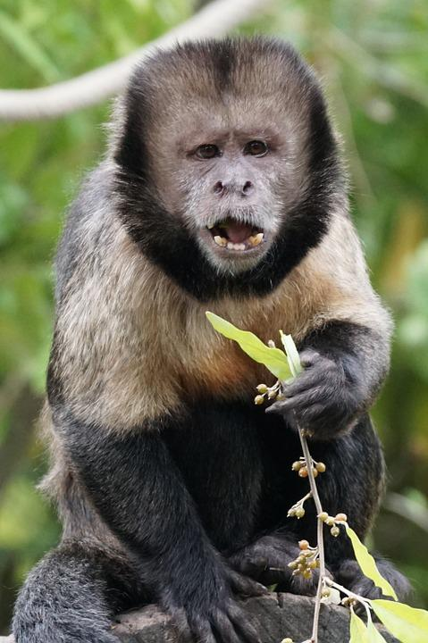
        <h1>임다영</h1>
        <p>
        Developer<br />
          Tech makes world more better
        </p>
        <a href="https://github.com/pam0701" class="btnView">View More</a>

        <ul class="contact"> <li>
          <a href="https://github.com/pam0701"><i class="fa-brands fa-github"></i> <span>visit my GitHub</span>
          </a>
          </li> <li>
            <i class="fa-solid fa-at"></i> <span>ldy290@gamil.com</span>
          </li>
          </ul>

          <nav class="others">
            <a href="./member_1.html"></a>
            <a href="./member_2.html"></a>
            <a href="./member_3.html" class = "on"></a>
          </nav>
    </section>


  </body>
</html>
```

◎ menu2.html

- 클라이언트에게 주류 추천 정보를 보여주는 html 페이지
- flip-card, snow(눈 내리는 효과), flying bird(새 날아다니는 효과), 흐르는 단어, 파도치는 효과 등의 시각적인 요소 배치
- header, xmas, propose, birth, footer의 크게 5가지 섹션으로 나누어 콘텐츠 배치<br>
  <br>
  ◎member1.html, member2.html, member3.html
- footer에 각각 멤버 소개 페이지로 갈 수 있는 버튼을 만들면 표시되는 페이지
- 각각 멤버들의 사진과 소개글 및 연락처를 확인할 수 있도록 구현<br>
  <br>

## js > menu2.js

- 반응형 헤더

```JavaScript
// Hide Header on on scroll down
var didScroll;
var lastScrollTop = 0;
var delta = 5;
var navbarHeight = $('header').outerHeight();

$(window).scroll(function(event){
    didScroll = true;
});

setInterval(function() {
    if (didScroll) {
        hasScrolled();
        didScroll = false;
    }
}, 250);

function hasScrolled() {
    var st = $(this).scrollTop();

    if(Math.abs(lastScrollTop - st) <= delta)
        return;

    if (st > lastScrollTop && st > navbarHeight){
        // Scroll Down
        $('header').removeClass('nav-down').addClass('nav-up');
    } else {
        // Scroll Up
        if(st + $(window).height() < $(document).height()) {
            $('header').removeClass('nav-up').addClass('nav-down');
        }
    }

    lastScrollTop = st;
}
```

스크롤 up, down에 따른 동작을 인식하여 반응형으로 헤더가 동작하는 함수를 구현<br>
<br>

- 플립 카드 기능

```JavaScript
/* SCROLL FLIP-Animation  */
class CardFlipOnScroll{
    constructor(wrapper, sticky) {
        this.wrapper = wrapper
        this.sticky = sticky
        this.cards = sticky.querySelectorAll('.card')
        this.length = this.cards.length

        this.start = 0
        this.end = 0
        this.step = 0
    }
    init(){
        this.start = this.wrapper.offsetTop
        this.end = this.wrapper.offsetTop + this.wrapper.offsetHeight - innerHeight
        this.step = (this.end - this.start) / (this.length * 2)
    }
    animate(){
        this.cards.forEach((card, i) => {
            const s = this.start + this.step * i
            const e = s + this.step * (this.length + 1)

            if(scrollY <= s){
                card.style.transform = `
                perspective(100vw)
                translateX(100vw)
                rotateY(180deg)
                `
            }else if(scrollY > s && scrollY <= e - this.step){
                card.style.transform = `
                perspective(100vw)
                translateX(${100 - (scrollY - s) / (e - s) * 100}vw)
                rotateY(180deg) `
            }else if(scrollY > e - this.step && scrollY <= e){
                card.style.transform = `
                perspective(100vw)
                translateX(${100 - (scrollY - s) / (e - s) * 100}vw)
                rotateY(${180 - -(scrollY - (e - this.step)) / this.step * 180}deg)
                `
            }else if(scrollY > e){
                card.style.transform = `
                perspective(100vw)
                translateX(0vw)
                rotateY(0deg)
                `
            }
        })
    }
}
const mainContent1 = document.querySelector('.main-content-1')
const sticky = document.querySelector(".sticky")
const cardFlipOnScroll = new CardFlipOnScroll(mainContent1, sticky)
cardFlipOnScroll.init()

window.addEventListener('scroll', ()=>{
    cardFlipOnScroll.animate()
})
window.addEventListener('resize', ()=>{
    cardFlipOnScroll.init()
})
```

CardFlipOnScroll 함수는 뒷 배경에 height 값을 주고 sticky한 속성을 주어 고정시켜두고 위의 떠있는 카드를 순차적으로 스크롤 동작에 따라 반응하도록 구현.<br>
<br>

- 파도 치는 효과

```JavaScript
/* FLOW-FOOTER */
const wrapper = document.getElementById("bubble-wrapper");
let index = 0;

const Color = {
  Red: "239, 83, 80",
  Orange: "255, 160, 0",
  Yellow: "253, 216, 53",
  Green: "42, 252, 152",
  Blue: "41, 121, 255",
  Indigo: "57, 73, 171",
  Violet: "103, 58, 183"
}

const colors = [
  Color.Red,
  Color.Orange,
  Color.Yellow,
  Color.Green,
  Color.Blue,
  Color.Indigo,
  Color.Violet
];

const animateBubble = x => {
  const bubble = document.createElement("div");

  bubble.className = "bubble";

  bubble.style.left = `${x}px`;

  wrapper.appendChild(bubble);

  setTimeout(() => wrapper.removeChild(bubble), 2000);
}
/* 마우스 좌표 찾아주는 기능 */
window.onmousemove = e => animateBubble(e.clientX);
```

조건(마우스 오버 된 영역)에 따라 bubble이 표시되는 영역이 달라지도록 setTimeout 함수와 onmousemove 함수를 사용하여 구현.
